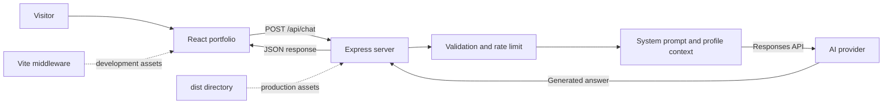

# Tutorial: Mratyunjay Tripathi Portfolio and AI Twin

A responsive React portfolio with an AI chatbot that answers questions from a verified professional profile. The browser never receives the AI provider key; chat requests pass through the Express server.

## What this project contains

- A single-page professional portfolio built with React and Vite.
- Responsive expertise, experience, about, credentials, and contact sections.
- An AI digital twin powered by the OpenAI Responses API.
- Conversation history, input validation, error handling, and basic per-IP rate limiting.
- One Node.js process for the API and the website in both development and production.

## Prerequisites

- Node.js `20.19+` or `22.12+` (required by the installed Vite version).
- npm.
- An OpenAI API key, or credentials for an OpenAI-compatible provider.

## Quick start

1. Clone the repository and enter its directory.

   ```powershell
   git clone <repository-url>
   cd web_profile
   ```

2. Install dependencies.

   ```powershell
   npm install
   ```

3. Copy the environment template.

   ```powershell
   Copy-Item .env.example .env
   ```

4. Open `.env` and replace the placeholder key.

   ```dotenv
   OPENAI_API_KEY=your_api_key
   OPENAI_MODEL=gpt-5-nano
   PORT=5173
   ```

   `OPENAI_BASE_URL` is optional and should only be set for another compatible provider. Never commit `.env` or put the API key in frontend code.

5. Start the development server.

   ```powershell
   npm run dev
   ```

6. Visit [http://localhost:5173](http://localhost:5173). Open **Ask my AI twin** to test the chatbot.

## Architecture



The project has two main runtime layers:

### Frontend

[`src/main.jsx`](src/main.jsx) contains the page data, React components, navigation, and `TwinChat`. [`src/styles.css`](src/styles.css) contains the complete responsive design. [`index.html`](index.html) supplies the root element and page metadata.

The frontend keeps chat messages in React state. When a visitor submits a question, `TwinChat` sends the question and recent conversation history to `/api/chat`, displays a typing state, and then renders either the answer or a safe error message.

### Backend

[`server.mjs`](server.mjs) creates the Express application and holds the chatbot's verified `PROFILE_CONTEXT` and behavior rules in `SYSTEM_PROMPT`. It validates requests, retains the latest eight history items, applies a rolling rate limit of 12 requests per IP per minute, and calls the configured model through the OpenAI SDK.

In development, Express mounts Vite as middleware, so `npm run dev` serves both the React application and API. In production, Express serves the compiled `dist` directory and keeps `/api/chat` on the same origin.

## How a chat request works

1. The visitor enters a question in `TwinChat`.
2. React immediately adds the visitor's message to the interface.
3. The browser sends this JSON to the server:

   ```json
   {
     "message": "What lending systems have you built?",
     "history": []
   }
   ```

4. Express trims the message to 1,000 characters and accepts only valid user/assistant history entries.
5. The server combines the recent history with the new question. The verified profile is supplied separately as model instructions.
6. The model produces a first-person answer grounded in the resume context.
7. Express returns `{ "answer": "..." }`, and React appends it to the conversation.

Contact details are only offered when a visitor explicitly asks to contact, connect with, or hire Mratyunjay. Unsupported profile questions should lead to a brief limitation and a relevant alternative topic rather than a repetitive contact response.

## Important files

| Path | Purpose |
| --- | --- |
| `server.mjs` | Express server, AI profile, prompt, validation, rate limiting, and production hosting |
| `src/main.jsx` | Portfolio content, React UI, and chatbot behavior |
| `src/styles.css` | Layout, theme, responsive rules, and chatbot styling |
| `index.html` | HTML shell, title, and SEO description |
| `.env.example` | Supported environment variables without secrets |
| `resume.pdf` | Source resume used to update the portfolio and AI context |
| `profile.pdf` | Older profile reference |

The PDFs are references only. They are **not parsed automatically at runtime**. When the resume changes, update both the visible content in `src/main.jsx` and the verified chatbot context in `server.mjs` so they remain consistent.

## Customizing the project

### Change personal information

- Update `PROFILE`, `skills`, `experience`, and `certifications` in `src/main.jsx`.
- Update `PROFILE_CONTEXT` in `server.mjs` with the same verified facts.
- Update the title and description in `index.html`.

### Change chatbot behavior

Edit `SYSTEM_PROMPT` in `server.mjs`. Keep grounding and privacy rules explicit. Facts belong in `PROFILE_CONTEXT`; tone, response limits, and interaction rules belong in `SYSTEM_PROMPT`.

### Change the design

Edit the variables at the top of `src/styles.css` for global colors. Layout rules are grouped by component, with tablet and mobile changes in the media queries near the end.

### Use another compatible model provider

Set these values in `.env`:

```dotenv
OPENAI_API_KEY=provider_key
OPENAI_BASE_URL=https://provider.example/v1
OPENAI_MODEL=provider_model_name
```

The provider must support the API behavior used by the OpenAI SDK and the Responses API call in `server.mjs`.

## Build and run in production

Create the optimized frontend bundle:

```powershell
npm run build
```

Start Express in production mode:

```powershell
$env:NODE_ENV='production'
npm start
```

The server will serve `dist` and the chat API from the configured `PORT`. Run `npm run build` again after every frontend change.

## Troubleshooting

- **Chat is not configured yet:** `OPENAI_API_KEY` is missing or `.env` is not in the project root.
- **The assistant is busy:** the provider returned a rate-limit response, or the local 12-requests-per-minute limit was reached.
- **Chat returns a 502 response:** check the server terminal for the provider status and error message; also verify `OPENAI_MODEL` and `OPENAI_BASE_URL`.
- **Frontend changes are missing in production:** rebuild with `npm run build` before restarting the server.
- **Port already in use:** choose another value such as `PORT=5174` in `.env`.

## Improvement scope

1. **Add automated tests:** cover request validation, contact-detail rules, rate limiting, chat errors, and responsive UI behavior.
2. **Use persistent distributed rate limiting:** replace the in-memory map with Redis so limits work consistently across restarts and multiple server instances.
3. **Create a structured content source:** store profile facts once in JSON or a CMS and generate both website content and chatbot context from it to prevent drift.
4. **Improve observability and evaluation:** add privacy-safe request metrics, structured error reporting, and a repeatable prompt-evaluation set for factual accuracy and interaction quality.
5. **Strengthen production delivery:** pin dependency versions, add CI checks, configure security headers, and deploy the frontend/API with health checks and documented secret management.
